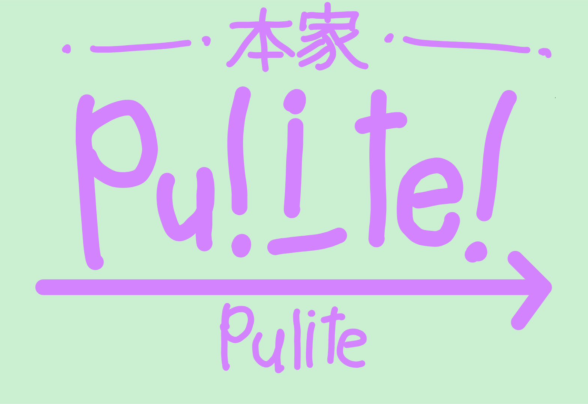

Work in progress
# pulite
## Chat Service
### Country of Origin: Japan

Pulite is a lightweight and minimal chat service designed for quick communication.

#### Instant messaging
#### Simple and easy‑to‑read UI
#### Compatible with both smartphones and PCs
#### Lightweight and fast performance
Do not use your real name.

## How to Access pulite

### [Access the web version](https://pulite.github.io)
### In restricted environments (such as school or workplace computers)
### Enter the following into the URL bar:
## `data:text/html,`
##### This method is not recommended.

# jp:
未完成
# pulite
## チャットサービス
### 作成国：日本

Pulite は、素早いコミュニケーションのために設計された、軽量でミニマルなチャットサービスです。

#### 即時メッセージ送信
#### シンプルで読みやすい UI
#### スマートフォンと PC の両方に対応
#### 軽量で高速な動作
本名を使用しないでください

## pulite のアクセス方法

### [Web 版にアクセス](https://pulite.github.io)
### 制限された環境（学校や職場のパソコンなど）の場合
### URL 欄に次を入力してください：
## `data:text/html,`
##### この方法は非推奨です。

##### This chat service was created using [TurboWarp](https://turbowarp.org/).

##### Creator: tasura
